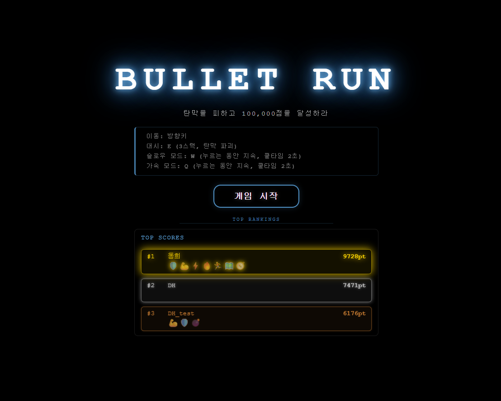
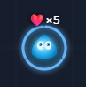
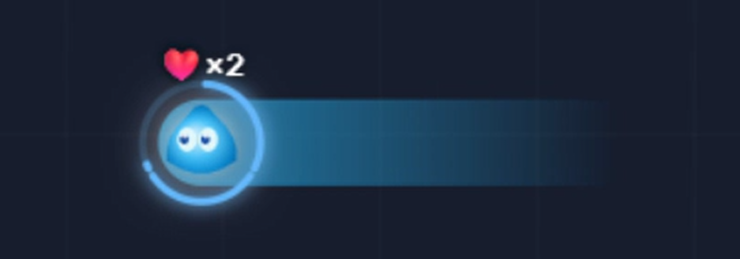
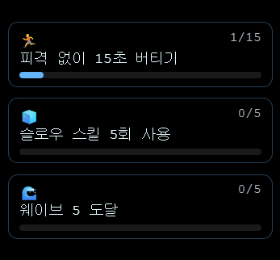
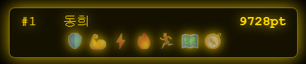
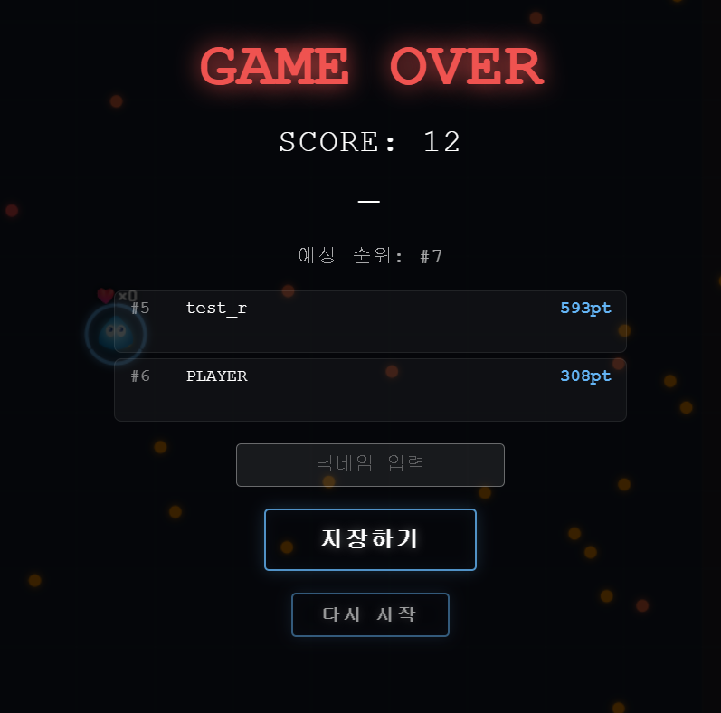

# _Bullet-Run_ (웹 기반 탄막 회피 게임 🎮)

🌐 <a href="https://bullet-run.vercel.app/">Live Demo 바로가기</a><br>
📌 CORP : KOSTA <br />
📌 DURATION <br>
<ul>
    <li>개발 기간 : 2026.04.06 ~ 2026.04.12</li>
</ul>
<br>

## 🛠️ _Skills_
| 분류             | 기술                                                         |
| ---------------- | ------------------------------------------------------------ |
| **Frontend**     | _HTML5_, _CSS3_, _JavaScript (ES6+)_, _Canvas 2D_            |
| **Build**        | _Vite_                                                       |
| **Backend / DB** | _Supabase (PostgreSQL)_                                      |

<br>

## _✔ Abstract_

> _웹 브라우저에서 즐기는 탄막 회피 게임. 대형 맵을 탐험하며 아이템을 수집하고, 레벨업하며 10만점 달성을 목표로 한다._
<div align=center>
    
</div>


<br>

## 📖 _Sections_

**플레이어 & 라이프**

> 플레이어 캐릭터는 이동하는 방향으로 눈이 이동한다. 플레이어의 라이프는 ❤️xN 으로 표시된다.

<div align='center'>
    
</div>
<br>

**탄막 회피 & 대시 시스템**

> 방향키로 이동하고, `E` 키 대시로 탄막을 파괴하며 무적 시간을 확보한다. 대시는 최대 3스택으로 3초마다 충전된다.

<!-- 스크린샷 추가 예정 -->
<div align='center'>
    
</div>
<br>

**아이템 & 레벨 시스템**

> 맵에 흩어진 아이템(❤️ 체력 / ⭐ 경험치 / ❄️ 슬로우 / 🛡️ 실드)을 수집해 레벨업하고 스탯을 강화한다. 별 10개를 연속 획득하면 **Fever Mode**가 발동된다.

**아이템 종류**

| 아이템 | 이모지 | 획득 EXP | 획득 점수 | 효과 |
| ------ | :----: | :------: | :-------: | ---- |
| 체력   | ❤️     | 0        | 30        | HP +1 회복 |
| 경험치 | ⭐     | 60       | 50        | EXP +60 (피버 트리거) |
| 슬로우 | ❄️     | 15       | 40        | 탄막 속도 35%로 4초간 감속 |
| 실드   | 🛡️     | 15       | 40        | 다음 피격 1회 방어 |

**레벨업 보너스**

| Lv | 누적 EXP | 보너스 |
| :-: | :------: | ------ |
| 1  | 0 (시작) | — |
| 2  | 100      | 이동속도 +10 px/s |
| 3  | 250      | 최대 HP +1 |
| 4  | 450      | 이동속도 +10 px/s |
| 5  | 700      | 대시 충전 -0.3s |
| 6  | 1,000    | 이동속도 +10 px/s |
| 7  | 1,350    | 최대 HP +1 |
| 8  | 1,750    | 이동속도 +15 px/s |
| 9  | 2,200    | 대시 충전 -0.3s |
| 10 | 2,700    | 이동속도 +20 px/s, 최대 HP +1 |

<br>

**미션 & 뱃지**
> 플레이 중 동적으로 미션이 부여되며, 달성 시 뱃지를 획득한다. 획득한 뱃지는 리더보드 점수와 함께 저장된다.

<!-- 스크린샷 추가 예정 -->
<div align='center'>
    <br><br>
    
</div>
<br>

**리더보드 (Supabase)**

> 게임 클리어 또는 게임 오버 시 점수와 이름을 등록할 수 있으며, 상위 랭킹을 시작 화면에서 확인할 수 있다.

<!-- 스크린샷 추가 예정 -->
<div align='center'>
    
</div>
<br>

## 📂 _Project Structure_

```plaintext
Bullet-Run/
├── index.html                    # 게임 HTML 진입점
├── README.md
├── .env                          # Supabase 환경 변수
├── vite.config.js
│
├── src/
│   ├── main.js                   # 진입점
│   ├── game.js                   # 메인 게임 루프 & 시스템 오케스트레이션
│   │
│   ├── core/
│   │   ├── constants.js          # 게임 전역 상수 (플레이어, 총알, 웨이브, 스킬 등)
│   │   └── utils.js              # 유틸리티 함수
│   │
│   ├── entities/                 # 게임 오브젝트
│   │   ├── player.js             # 플레이어 이동, 대시, 피격
│   │   ├── bullet.js             # 총알 매니저 & 물리
│   │   ├── item.js               # 아이템 스폰 & 수집
│   │   └── villain.js            # 보스 엔티티
│   │
│   ├── systems/                  # 게임 시스템
│   │   ├── camera.js             # 카메라 추적
│   │   ├── map.js                # 맵 레이아웃 & 존 관리
│   │   ├── wave.js               # 웨이브 & 난이도 진행
│   │   ├── level.js              # 레벨 & EXP 시스템
│   │   ├── score.js              # 점수 관리
│   │   ├── minimap.js            # 미니맵 렌더링
│   │   ├── mission.js            # 미션 & 뱃지 시스템
│   │   ├── bomb-necklace.js      # 폭탄 목걸이 특수 기믹
│   │   └── input.js              # 키보드 입력 처리
│   │
│   ├── ui/                       # 사용자 인터페이스
│   │   ├── ui.js                 # HUD & 화면 관리
│   │   ├── ui.css
│   │   └── screens.css
│   │
│   └── services/
│       └── supabase-client.js    # Supabase 연동
│
├── styles/
│   └── main.css                  # 전역 스타일
│
├── assets/
│   └── images/                   # 게임 이미지 에셋
│
└── docs/                         # 게임 기획서, 구현 계획
    ├── GAME_PRD.md
    └── todo_plan/
```

<br>

## ✅ _Game Loop Flow_

```
브라우저 요청
  └─ index.html 파싱
       ├─ CSS 로드 (main.css)
       └─ main.js 실행
            └─ Game.init()
                 ├─ 시스템 초기화
                 │    ├─ Map, Camera, Input
                 │    ├─ Wave, Level, Score
                 │    ├─ Minimap, Mission
                 │    └─ Player, Bullet, Item, Villain
                 ├─ requestAnimationFrame 루프 시작
                 │    ├─ update()  ← 입력 처리 / 물리 연산 / 충돌 감지 / 시스템 업데이트
                 │    └─ render()  ← Canvas 2D 렌더링 (맵 → 엔티티 → UI)
                 └─ Supabase      ← 점수 저장 / 랭킹 조회
```

<br>

## ⚙️ _Key Mechanics_

🎮 **Game Balance**

```
MAP_SIZE      : 2880 × 2048 px  (3×2 그리드, 6개 존)
CLEAR_SCORE   : 100,000 pts
MAX_LEVEL     : 10
MAX_LIVES     : 10  (시작 5)
WAVE_COUNT    : 10  (웨이브당 총알 속도 +8%, 밀도 +15%)
DASH_STACK    : 3   (3초마다 충전, 대시 중 무적 & 총알 파괴)
SLOW_STACK    : 5   (W키 홀드 → 총알 35% 속도, 1초마다 충전)
FEVER_TRIGGER : 별 아이템 10개 연속 수집 (5초 유지)
```

<br>

🔄 **Render Game**

매 프레임 `_render()`는 **월드 공간 → 스크린 공간** 두 단계로 나뉜다.

```
_render()
  │
  ├─ camera.apply(ctx)          ← ctx.translate(-camera.x, -camera.y)
  │                                월드 원점을 카메라 오프셋만큼 이동
  │                                → 이후 모든 draw는 월드 좌표 그대로 사용
  │
  ├─ [월드 공간] map → items → bullets → player → effects → bomb → villain
  │
  ├─ camera.restore(ctx)        ← ctx.restore() — 스크린 원점 복원
  │
  └─ [스크린 공간] fever 테두리 / 폭탄 HUD / 빌런 HUD / 미션 힌트 이모지
```

<br>

📷 **카메라 추적 (camera.js)**

플레이어를 화면 중앙에 고정하고, 맵 경계를 넘지 않도록 클램프한다.

```js
// 매 프레임 update() 마지막에 호출
this.camera.follow(this.player.x, this.player.y);

// camera.js — follow()
follow(targetX, targetY) {
  // 목표: 플레이어를 뷰포트 정중앙에 배치
  this.x = clamp(targetX - this.viewW / 2, 0, MAP_WIDTH  - this.viewW);
  this.y = clamp(targetY - this.viewH / 2, 0, MAP_HEIGHT - this.viewH);
}
```

```
카메라 이상적 위치 (클램프 전)
  camera.x = player.x - viewW / 2
  camera.y = player.y - viewH / 2

경계 클램프
  camera.x ∈ [0,  MAP_WIDTH  - viewW]   →  맵 왼쪽/오른쪽 끝 초과 방지
  camera.y ∈ [0,  MAP_HEIGHT - viewH]   →  맵 위쪽/아래쪽 끝 초과 방지
```

**월드 → 스크린 좌표 변환**

`camera.apply()` 이후 Canvas의 원점이 `(-camera.x, -camera.y)` 로 이동했으므로,
모든 엔티티는 월드 좌표 그대로 그려도 화면에서 올바른 위치에 나타난다.

```
screen_x = world_x - camera.x
screen_y = world_y - camera.y

// 스크린 공간 UI (camera.restore 이후) 에서의 변환 예시
// → 미션 힌트 이모지를 플레이어 머리 위에 그리기
sx = player.x - camera.x
sy = player.y - camera.y
ctx.fillText('💡', sx, sy - player.radius - 60)
```

**뷰포트 컬링 (isVisible)**

오프스크린 오브젝트의 렌더링을 건너뛰어 성능을 최적화한다.

```js
// camera.js
isVisible(worldX, worldY, margin = 0) {
  return worldX + margin > this.x              &&
         worldX - margin < this.x + this.viewW &&
         worldY + margin > this.y              &&
         worldY - margin < this.y + this.viewH;
}
// items.render(), bullets.render() 내부에서 camera.isVisible()로 skip
```

<br>

🗺️ **Minimap**

```
크기      : 240 × 171 px  (맵 비율 유지 → MM_H = round(240 × 2048/2880) = 171)
존 색상   : 🟢 safe  🟡 normal  🔴 high-risk  🔵 event
표시 요소 : 존 배경 색상 / 아이템 종류별 색상 점 / 플레이어 (흰 점 + 파란 테두리)
```

**좌표 변환 (월드 → 미니맵)**

월드 좌표계(2880×2048)를 미니맵 픽셀 좌표계(240×171)로 선형 축소한다.

```
축척 계수
  SCALE_X = MM_W / MAP_WIDTH  = 240 / 2880 ≈ 0.0833
  SCALE_Y = MM_H / MAP_HEIGHT = 171 / 2048 ≈ 0.0835

위치 변환 공식
  minimap_x = world_x × SCALE_X
  minimap_y = world_y × SCALE_Y
```

**핵심 코드 (minimap.js)**

```js
// 축척 계수 — 모듈 로드 시 한 번만 계산
const MM_W   = 240;
const MM_H   = Math.round(MM_W * (MAP_HEIGHT / MAP_WIDTH)); // ≈ 171
const SCALE_X = MM_W / MAP_WIDTH;
const SCALE_Y = MM_H / MAP_HEIGHT;

// 아이템 위치 → 미니맵 점
for (const item of items) {
  if (!item.alive) continue;
  ctx.beginPath();
  ctx.arc(item.x * SCALE_X, item.y * SCALE_Y, 2.2, 0, Math.PI * 2);
  ctx.fillStyle = ITEM[item.type].color; // 아이템 종류별 색상
  ctx.fill();
}

// 플레이어 위치 → 흰 점 + 파란 테두리
const px = player.x * SCALE_X;
const py = player.y * SCALE_Y;
ctx.arc(px, py, 4, 0, Math.PI * 2);
ctx.fillStyle   = '#ffffff';  // 흰 점
ctx.strokeStyle = '#64b5f6'; // 파란 테두리
```

<br>

## 🔄 _Init Project_

```bash
npm install
npm run dev
```

<br>
